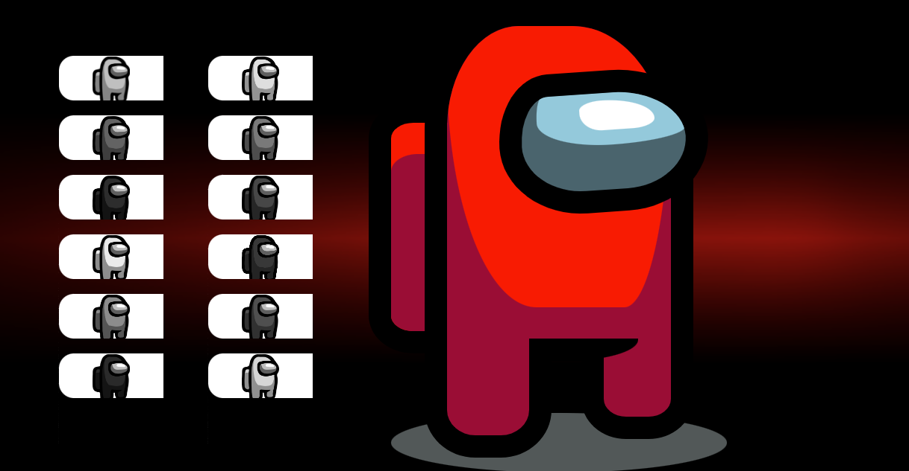
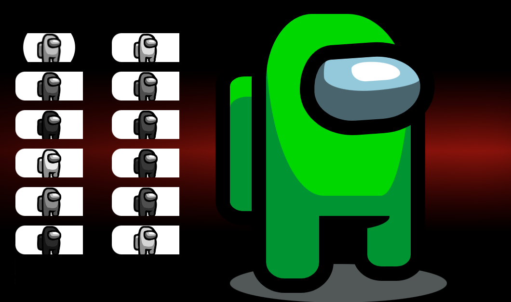
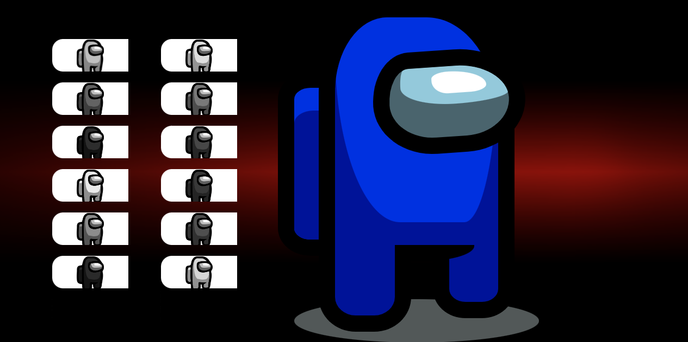
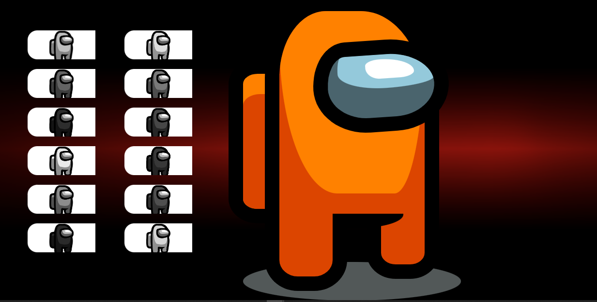
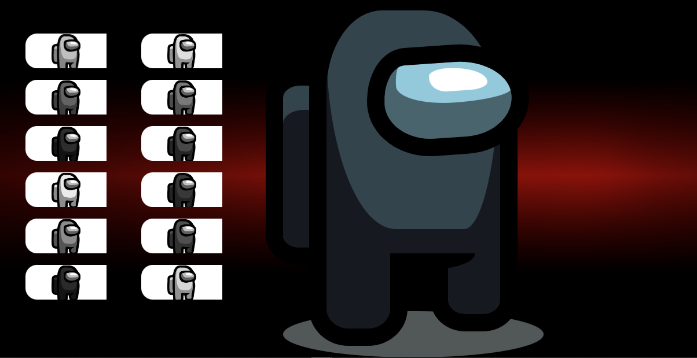

  
  <h1 align="center">Among Us</h1>

 
# Sobre o projeto
Um site inspirado no jogo que por um tempo ficou muito famoso Among Us
## Layout 

# Tecnologias utilizadas
- Html
- Css
- JavaScript

# Autor

## @Duck.Web

<!-- INSTAGRAM -->

